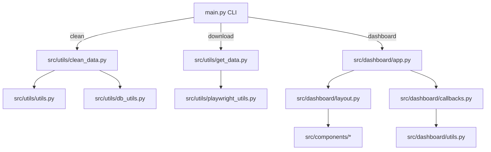

# Rain & Dust Spikes Dashboard

Event-study of gamma-dose spikes after rainfall in metropolitan France based on RNM/ASNR sampling campaigns and Météo-France SYNOP precipitation totals.

## User Guide

### Prerequisites
- Python 3.11+
- System packages required by Playwright browsers (see https://playwright.dev/python/docs/intro)
- Git and a modern web browser for opening the dashboard

### Installation and data refresh
1. Clone the repository on the target machine: `git clone <repo> && cd rain-gamma-spikes-france`.
2. Create an isolated environment and install the dependencies:
   ```bash
   python -m venv .venv
   source .venv/bin/activate
   pip install --upgrade pip
   pip install -r requirements.txt
   playwright install chromium
   ```
3. Download the latest data from ASNR, Météo-France and the municipality gazetteer:
   ```bash
   python main.py download
   ```
4. Clean and consolidate the raw files into `data/cleaned/data.csv`:
   ```bash
   python main.py clean
   ```

### Running the dashboard locally or remotely
- Start the Dash server (defaults to `http://127.0.0.1:8050`):
  ```bash
  python main.py dashboard --host 0.0.0.0 --port 8050
  ```
- The application automatically serves static assets from `src/assets` and reads the cleaned dataset from `data/cleaned`.
- When deploying to a remote VM, keep the virtual environment activated, expose port 8050 (or use a reverse proxy), and optionally set `PYTHONPATH=$PWD` if the project is installed outside the home directory.

## Data

### Gamma radiation (ASNR / Mesure Radioactivité)
- Data scraped via Playwright from https://mesure-radioactivite.fr/#/expert.
- Includes soil and water samples between 2020-01-01 and 2025-01-01 with radionuclide, unit, measurement environment, latitude/longitude.
- File pattern: `data/raw/asnr_*_radiation_data_*.csv` with cleaned outputs stored in `data/cleaned/data.csv`.

### Weather (Météo-France SYNOP)
- Bulk CSV download from https://www.data.gouv.fr/api/1/datasets/r/92065ec0-ea6f-4f5e-8827-4344179c0a7f.
- Provides Lambert 93 coordinates, rainfall (`PRELIQ`) and snowfall (`PRENEI`) per observation.
- During cleaning the Lambert coordinates are projected to WGS84 (`pyproj`) and matched to the closest radiation measurement via a `BallTree`.

### Municipality gazetteer (Ville de Rêve)
- CSV file downloaded from https://www.data.gouv.fr/api/1/datasets/r/f5df602b-3800-44d7-b2df-fa40a0350325.
- Supplies standardised municipality names, population counts and fallback coordinates to enrich radiation measurements when ASNR metadata is incomplete.

### Cleaned dataset
- Final semicolon-separated file located at `data/cleaned/data.csv` with 16 columns.
- Key fields used by the dashboard: `Date start sampling radioactivity`, `Result radioactivity`, `Unit radioactivity`, `Measurement environment`, `Rainfall`, `Snowfall`, `Municipality name`, `Latitude`, `Longitude`, and `Distance measurement weather and radiation m`.

## Developer Guide

### Architecture overview


- **CLI (`main.py`)** orchestrates three commands: `download`, `clean`, and `dashboard`.
- **Data ingestion** (`src/utils/get_data.py`) opens a headless Chromium session, navigates the ASNR website, downloads weather/municipality files, and persists them under `data/raw`.
- **Data cleaning** (`src/utils/clean_data.py`) standardises municipality names (`unidecode`), projects Lambert coordinates (`pyproj`), joins weather/radiation records using nearest-neighbour search (`sklearn.BallTree`) and writes consolidated CSV files under `data/cleaned`.
- **Dashboard package** (`src/dashboard`) exposes `create_app()`, `build_layout()`, and `register_all_callbacks()`; it loads the cleaned dataset once, serialises it with `src/dashboard/utils.py` and wires UI components located in `src/components`.

### Adding a new page or chart
1. **Extend the dataset**: add new derived columns in `src/utils/clean_data.py` and expose them via `CLEANED_DATA_CONFIG` in `config.py`.
2. **Create a reusable component**: add a builder in `src/components` (follow the stat-card helpers in `sections.py`).
3. **Update the layout**: import the new component inside `src/dashboard/layout.py` and insert it inside `build_layout()`.
4. **Register callbacks**: implement the interaction logic in `src/dashboard/callbacks.py`, using `deserialize_dataset()` from `src/dashboard/utils.py` to access the cached dataframe.
5. **Test**: run `python main.py dashboard --debug` and validate the new controls/graphs locally before deploying.

## Rapport d'analyse
- The cleaned dataset contains 171,545 measurements collected between 2020-01-01 and 2025-01-01 across 395 municipalities, with soil samples representing 24% of the records (41,110 rows) and water samples 76% (130,435 rows).
- Heavy rain events remain relatively rare (14% of observations record ≥5 mm of precipitation) yet coincide with a slightly higher median gamma result: 1.1 Bq versus 0.94 Bq for drier periods, suggesting rain is associated with moderate spikes rather than extreme outliers.
- Soil samples show a higher median dose (1.4 Bq/kg dry) than water samples (0.52 Bq/L), confirming that terrestrial media retain more radionuclides after precipitation.
- The top decile of radioactivity measurements occurs on rainy days (≥1 mm) 31.5% of the time, roughly matching the overall rain frequency (31.3%), which indicates that while rainfall correlates with modest increases, exceptional spikes likely depend on local site characteristics rather than rainfall alone.

## Copyright
I/we declare on my/our honour that all source code in this repository was produced by the project authors, except for the official libraries referenced in `requirements.txt`. No external code snippets were copied verbatim; therefore no additional citations are required. Any future re-use of third-party code must be explicitly documented in this section with the original source and an explanation of the borrowed syntax. All other lines are deemed original work by the authors, and undeclared reuse will be treated as plagiarism.
